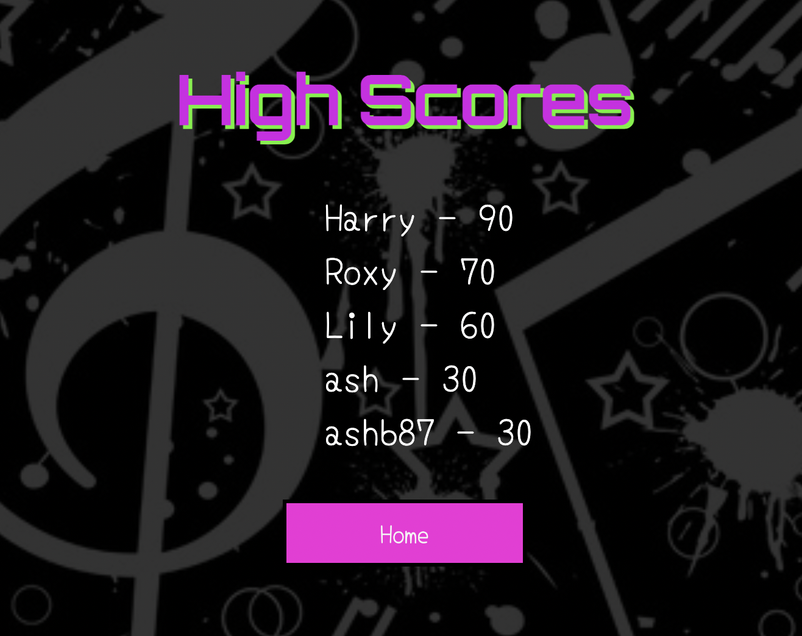

# Milestone Project Two | Music quiz game

[View the live project here](https://ashb87.github.io/Quiz-Ms-Project-Two/)  

## About

This website has been created for my Milestone 2 Interactive Frontend Development project. 
I want to create a music quiz game with a varied choice of questions based on all types of music to test the users knowledge. The user will be given a random 10 questions, worth 10 points a quesiton, with 30 seconds to answer each.
With a maximum of 100 points availible, the user will then be able to save their high score and try to get on the top 5 leaderboard.

## User Experience-(UX)

### Site Goals

  1. I want the site to be attractive, responsive and easy to use for the user.
  2. I want the site to work as intended incrementing the quesitons and score as the user progresses, with the timer going down for each question.
  3. I want the user to have a varied choice of questions.
  4. I want the user to be able to save their score.
  5. I want the user to be able to navigate easily through the different pages of the site.

### User Stories

  * #### First Time Visitor Goals
    1. I want the game to be attractive and and easy to read all text.
    2. I want the game to be responsive to whichever device I am playing it on.
    3. I want to be able to navigate around the different pages of the site.
    4. I want to be able to learn how the game works.
    5. I want to be given a choice of varied questions.

  * #### Returning/ Frequent Visitor Goals
    1. I want to be given varied questions each time I play.
    2. I want to be able to record my score and try to get on a leaderboard.
    3. I want to see other users previous scores so I can try to beat them.

### Design

Because of the topic of the quiz, I want the design of the website to have a music themed background. It needs to be pleasing for the user to look at with the game elements easily distinguishable from the background so that everything is clear and easy to use. To do this I will have a fairly dark background with brighter colours being used for the game so they will contrast nicely together.
I want to keep a consistent theme throughout the site by using the same colour combinations on each page. With the site being attractive for the user and easy to use I am hoping the user will want to keep returning to play the game.

  * #### Wireframes

  To make my wireframes I have used balsamiq. I have done one for each page and did a design for larger screens and smaller screens to show how the site will be responsive to screen size and change accordingly. The links to each one are below.  
  **__For easier viewing I would recommend clicking the 
  dowload button above the wireframe image as they appear much larger when viewed directly through github__**
  * [Desktop display](https://github.com/Ashb87/Quiz-Ms-Project-Two/blob/master/Quiz-project-Ms2/Desktop-wireframe.png)
  * [Mobile and Tablet display](https://github.com/Ashb87/Quiz-Ms-Project-Two/blob/master/Quiz-project-Ms2/Mobile_Tablet%20wireframe.png)

The design of my project has been kept very similar to that of my wireframes. The main difference was on larger screens I had planned to have the answer boxes displayed with two side by side above another two side by side. I decided in the end to display all four answer boxes stacked on top of each other as I found the questions with longer answers were fitting better this way without having to adjust the font size. The text was then not looking too squashed inside its container. I kept the same display throughout all screen sizes adjusting any font sizes accordingly.  

  * #### Imagery

For this project I have used one image to be the main background across all the different pages of the site. It is a black and white patterend image with a music theme. I also placed a transparent overlay on top of the image to soften the brightness of it, and help enhance the interactive parts of the site for the user making it all stand out clearly and be visually appealing as well as usable and easy to see.

  * #### Color Scheme

For this project I wanted the colours to be vibrant and really pop out against the darker background that I chose. My three main colours are a shade of **Pink,** **Yellow** and **Greeen** which are named **Hot Magenta,** **Sizzling Sunrise** and **Harlequin** respectively. I have used these colours throughout all the differnt elements of the game including text colour and text shadow, buttons, links and shadowing for all the clickable elements. I had a general idea of what colours I wanted to use and then used the google color picker to find the exact shades I wanted and that I feel have complimented each other really well. 

    

  * #### Typography

The two fonts I have used in this project are **Yomogi** and **Orbitron** both imported from **Google fonts.** The **Orbitron** font has been used for my h1 headings and also the quesion counter and score counter on the game page. I have used **Yomogi** for everything else. I chose these because I wanted something bold and a bit different to stand out for the headings and found **Orbitron** fitted this really well and suited the style of design I was going for. For the rest of the text I wanted something that would be easy to read, compliment the orbitron font and also be a little different to standard fonts. When searching google fonts **Yomogi** was the one that stood out to me the most and I think looks great with the rest of the design. 
  
## Features

The design and layout of the game is responsvie to all different screen sizes and remains attractive and easy to use no matter what device it is being played on.

  * ### Home Page
    * Pop up modal when user clicks on the **rules** button that explains how the game works.
    * **High Scores** button that when clicked will link the user to the top 5 highscores. These scores are stored and pulled from local storage.
    * **Play** button that links the user to the main game page.
    * Social media links that I have used to help with the design of the page. These links will just take the user to the home page of the selected link.

  * ### Game Page
    * A question counter that shows the user which question number they are on out of 10.
    * A score counter that shows the user what they're current score is and that increments by 10 for every correct answer.
    * A question and 4 possible answers to choose from. The selected answer will turn red if it is wrong and green if it is correct.
    * A 30 second timer that counts down on screen and resets for each new question.
    * A home button that will take the user back to the main page.

  * ### End Page
    * A display of the users and score.
    * A message for the user that changes depending on the score achieved.
    * The optiion for the user to enter their name and save their score which will be added to the highscore page if the score is high enough.
    * A button to let the user play again.
    * A button to take the user back to the home page.

## Features I would like to implement
If I was to take this game further I would like to add some different features for the user. These are:
  * The options to be more specific with which questions they could answer. For example they could choose from different decades of music like 60's, 70's 80's. Or pick the genre of music they like most, e.g rock, RnB, pop. 
  * An option to chose the level of difficulty of the questions.
  * The option to share their score on social media directly from the game.

## Technologies used
  ### Languages used

  * [HTML5](https://developer.mozilla.org/en-US/docs/Web/Guide/HTML/HTML5)  
     The project uses HTML5 to make up the basic elements and structure of the website.
  * [CSS3](https://developer.mozilla.org/en-US/docs/Web/CSS)  
     I have used CSS3 to add my own styling to the project including layout, fonts and colours.
  * [JavaScript](https://developer.mozilla.org/en-US/docs/Web/JavaScript)  
     JavaScript has been used to implement the site's interactive features, Allowing the user to be interactive with the game.

  ### Frameworks, Libraries and Programs Used

  * [Balsamiq](https://balsamiq.com/)  
     I used balsamiq to design and draw up my wireframes before starting the project.
  * [Bootstrap](https://getbootstrap.com/)  
     I used the custom built bootstrap modal for my pop up **Rules** button expianing to the user how the game works.
  * [Font Awesome](https://fontawesome.com/)  
     This was used for the logos of the social media links on my home page and also the clock symbol and home button on the game page.  
  * [Google Fonts](https://fonts.google.com/)  
     Google fonts was used throughout the project to import my selected fonts **Orbitron** and **Yomogi**.
  * [Gitpod](https://www.gitpod.io/)  
     Gitpod was the text editor I used to write all of my HTML, CSS and JavaScript code to style, structure and make the game interactive.
  * [Git](https://git-scm.com/)  
     Git is used as version control software to add, commit and push code to my GitHub repository where the code is then stored.
  * [GitHub](https://github.com/)  
     I have used GitHub as a remote repository to push and store the committed changes to my project from Git. GitHub pages has also been used to deploy my live site.
  * [Google Chrome Developer Tools](https://developer.chrome.com/docs/devtools/)  
     I have used Google chromes built in developer tools to help with the styling of the site, selecting colors and to help 
     fix any bugs I found.
  * [Open Trivia Base](https://opentdb.com/api_config.php)  
     Open Trivia Base is a free JSON API that I have used to generate the questions for my quiz.

## Testing

### Testing User Stories and Site Goals

### Site Goals

  **1. I want the site to be attractive, responsive and easy to use for the user.**

  - To get feedback on the visual aspect of the project it has been shared with many friends and family and also other students of code institute via the slack portal. The feedback on the visual aspect has been really good, with the choice of colors and fonts receiving very positive reviews.
  - I have tested the site on many differnet screen sizes, including, Iphone Xr, Iphone 12, Ipad mini, Samsung Galaxy tablet, Macbook air and IMac desktop.
  The site responds well to the different screen sizes and the layout adapts as intended. This has been achieved using the CSS flexbox grid system
  - The game has a clear and simple layout making it easy for the user to navigate through and play. With contrasting colours making all the different features clear and visible for the user to see.

  **2. I want the site to work as intended incrementing the quesitons and score as the user progresses, with the timer going down for each question.**

  - After testing the game many times across multiple devices I am confident that the features are working as intended. The quesiotn counter runs from 1 to 10 and ends the game after the 10th question taking the user to the end game page and siplaying their score. The score increments as expected awarding 10 points for each correct answer and the time decreases form 30 seconds for each question. If the time runs out on a quesetion it automatically moves the player onto the next question.

  * Question counter  
   
  * Score counter  
   
  * Question timer  
   

  **3. I want the user to have a varied choice of questions.**

  - Using the **Open Trivia Base** website the game pulls a set of random music based questions from a JSON API. This gives the user a good chance of getting all new questions when replaying the game.

  **4. I want the user to be able to save their score.**

  - When the user has finished the game they will be taken to the end game page. From here they will have the option to enter their name and save their score. This is saved to local storage and then the top 5 highest scores are pulled from the local storage and displayed on the highscore page.

  

  **5. I want the user to be able to navigate easily through the different pages of the site.**

  - From the home page the user is given the option to check the rules, play the game or check the highest scores so far achieved in the game. These are all easy to navigate to through the click of a button.
  - From the game page the user is able to navigate back to the home page by clicking on the home icon in the bottom right below the answer options.
  - From the end page the user is able to navigate back to the home page or choose to play again by clicking on either of the buttons. 

  * All of these links work as expected and have been tested many times across different devices, each time with the same positive result.

### User Stories

### First Time Visitor Goals 

  **1. I want the game to be attractive and and easy to read all text.**

  - I have asked many friends, family and also members of the slack community for their honest feedback on the design and layout of the game. It has recieved very positive reviews especially regarding the colour scheme with many people commenting how well the game features stand out and enjoy the vibrant colour sceme used throughout the project. By using the dark background as a contrast against the more vibrant game features at the forefront, the text is clear and easy to read. The choice of font has also ensured that all text is easily readable.

  **2. I want the game to be responsive to whichever device I am playing it on.**

  - By keeping the design of the layout simple and the same across all devices it easily conforms to whichever screen size it is on. By adding the use of media querys I have also reduced the size of some of the text for when being played on smaller screens to prevent any of the page leaking out to the sides.
  - I have tested the site on many differnet screen sizes, including, Iphone Xr, Iphone 12, Ipad mini, Samsung Galaxy tablet, Macbook air and IMac desktop. The game responds well to the different devices and screen sizes and the layout adapts as intended. 
  - I also ran the site through the mockup screenshot generator [am i responsive](http://ami.responsivedesign.is/) and have used the resulting image at the top of this README file.

  **3. I want to be able to navigate around the different pages of the site.**

  - *See point 5 of **Site Goals**.*

  **4. I want to be able to learn how the game works.**

  - From the home page the user has the option to click on the **Rules** button. This will bring up a modal explaining how the game works. The modal has been made using the pre built modal example in bootstrap.

    

  From the here the user can either click out of the modal taking them back to the home page or click the *Lets Go* button to take them straight to the game page.

  **5. I want to be given a choice of varied questions.**

  - *See point 3 of **Site Goals**.*

### Returning/ Frequent Visitor Goals

  **1. I want to be given varied questions each time I play.**

  - Thanks to the large database of questions being pulled from the **Open Trivia Base** API, the user shouldn't experience too many repeat questions too often. 
  - When being tested by friends and family and also memebers of slack the general feedback was that each time they played they were getting new questions with very few repeats. I asked if they could play the game between 5-10 times each to test the variety of questions. So am pleased with the feedback recieved and confident that a user will get a good variation of questions when returning to the game.

  **2. I want to be able to record my score and try to get on a leaderboard.**

  - When finishing the game the user will have their score displayed on the screen. Depending on the score they achieve will bring up a different message. From here they will have the choice to enter their name and save their score. The top 5 scores will be saved to a leaderboard that can be viewed from the homepage. The user will be able to see if their name is on it from here.
  - The users scores are saved to local storage.

    

  **3. I want to see other users previous scores so I can try to beat them.**

  - From the home page the user can click the *Highscores* button and be taken to the top 5 leaderboard. These scores are saved to and pulled from local storage and spliced and put in order to just display the top 5 scores. 
  - This has been tested using different devices to check that the scores save and display as they should.

     
  

### fixed bugs 
  * json file giving &quot-- changed innerText to innerHTML